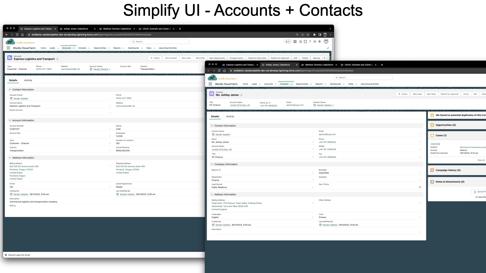
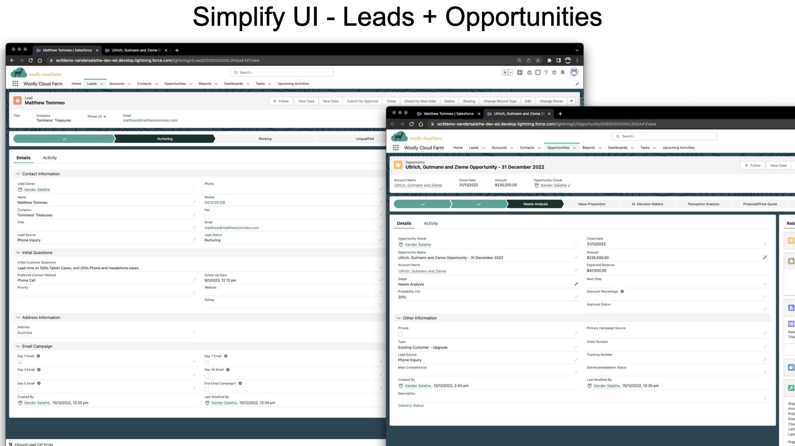
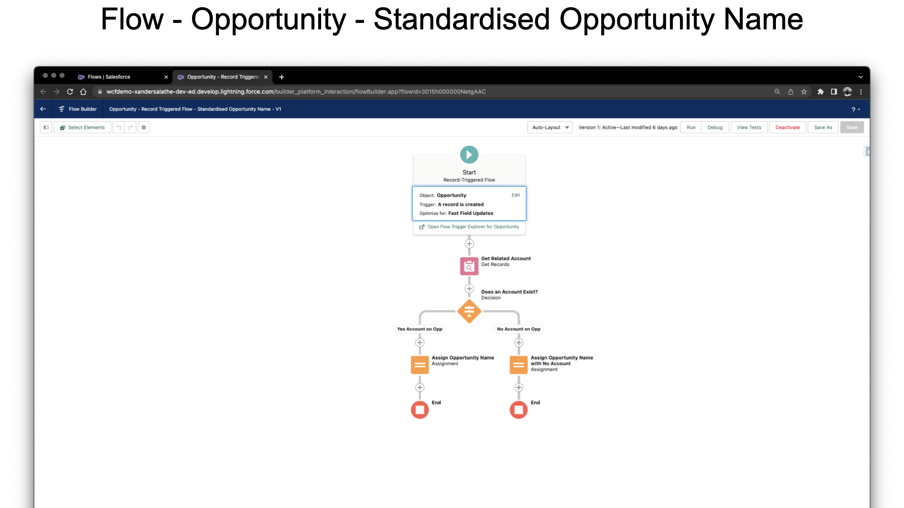

# Sales Cloud Declarative Org project

This project was created to practice declarative changes within Salesforce. 

## Deliverables

## Sync Org metadata to GitHub
Salesforce doesn't directly integrate to GitHub. 
In order to save changes to your org to GitHub you need to first download the metadata, and then sync to a repo as you would for any other project.

To download the metadata:
1. Install [Salesforce CLI](https://developer.salesforce.com/tools/salesforcecli)
2. Install [VSCode extensions](https://marketplace.visualstudio.com/items?itemName=salesforce.salesforcedx-vscode)
3. [Enable and install DevOps Center in the org](https://help.salesforce.com/s/articleView?id=sf.devops_center_setup_install.htm&type=5)
4. Create a SFDX Project in VS Code from your Salesforce instance
    - Inside VS Code, open the command pallet `Ctrl + Shift + P` and run `SFDX: Create Project with Manifest`.
    - Choose the `empty` template.
    - Give the project a name, eg `SFDX-Project`
    - Choose the local folder location. 
5. Retrieve source doe from your Salesforce instance
    - Open the command pallet
    - Run `SFDX: Authorize an Org`
    - Choose the type of org, eg `Production`
    - Login via your browser
    - Once authenticated open the folder `manifest`, right-click the file `package.xml`, and run the command `SFDX: Retrieve Source in Manifest from Org`.

This does not necessarily download all your metadata - due to Salesforce using a combination of declarative, and programattic tools for changes best practice is to use GitHub for *only* the components that are changed programattically.

If a Salesforce Admin made a declarative change, this would have the potential to be overridden if the component was tracked here.

Beyond this - Salesforce limits requests per day - as such depending on Org size, if all components are tracked you may exceed limits. 

Given this projects:
- has a limited scope (and is therefore unlikely to hit request limits) 
- has no future updates planned
- is worked on only by myself

I have elected to backup *all* components. 

### GitHub Actions
#### Automate metadata backups 
This project uses a GitHub action to create backups if differences are found. This occurs daily, at midnight. 

## Discussion
A full break down of this project can be found in the following posts. 
1. [Creating a Demo Org with Salesforce, Jira and Artificial Intelligence.](https://www.xandersalathe.com/salesforce/creating-a-simple-demo-org-with-salesforce-jira-and-artificial-intelligence)
2. [Presenting your Salesforce Demo Org](https://www.xandersalathe.com/salesforce/presentingyourdemoorg)
